# GCP’de Kubernetes cluster kurulumu 

(*Batur*) Bahadir Bakkaloglu 

this file created as .docx . I wasn't planning to publish this on public. At first i thought it as we will mailto some adrees

 for now i used docx to md converter. That is why it is very unordered. it'll be fixed soon

**Credits :** I’ll apply the instructions from[ HashiCorp Learn’s Repository](https://github.com/hashicorp/learn-terraform-provision-gke-cluster) with small *tweaks*

After gcloud auth procedure

We will want to determine our variables

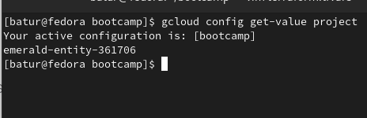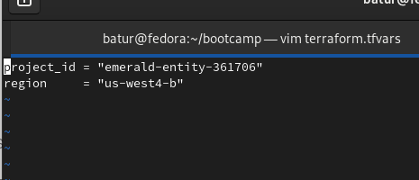

To use terraform there should be initialization step to set up terraform files to our repository:

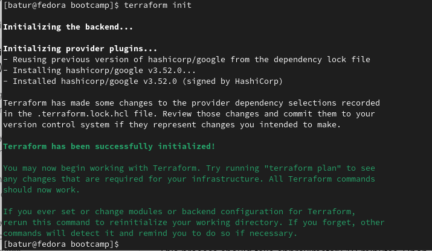

As we apply .tf scripts takes its instructions to set up infrastructure on GKE as requested.

Here is modules that it will create for us :

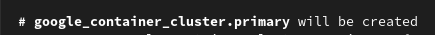

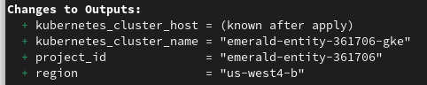

Of course we will want give it a chunky yes:

Things happen.. You know

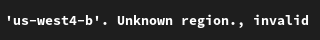

Here is quick fix

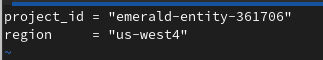

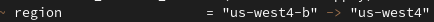

Hit enter harder and it wont happen again(just joking)

Apparently it can, even when you push buttons harder..

[This ](https://cloud.google.com/migrate/containers/docs/config-dev-env)document on gke gave me that command : 

gcloud services enable servicemanagement.googleapis.com servicecontrol.googleapis.com cloudresourcemanager.googleapis.com compute.googleapis.com container.googleapis.com containerregistry.googleapis.com cloudbuild.googleapis.com

Let’s be gentle about clicking enter this time

✨💫 And that worked  \(★ω★)/ 💫✨

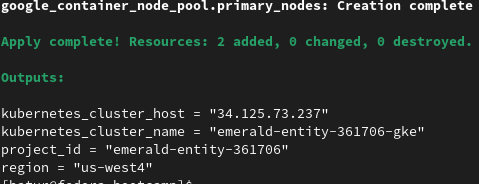

Lets check on gcloud console

⚡🇮‌🇹‌🇸‌ 🇦‌🇱‌🇮‌🇻‌🇪‌⚡

*Attention :*

` `*Hitting enter hard or gentle does not provide any benefits. I assume this is can be correlated to [this](https://www.youtube.com/watch?v=8AzjDs8aF7g) idea*

Extra :

I know we have reached our milestone but I want to continue Hashicorp learns instructions. Because it looks fun!

i ‘ll deploy kubernetes dashboard

We will apply [recommended.yaml](https://raw.githubusercontent.com/kubernetes/dashboard/v2.0.0-beta8/aio/deploy/recommended.yaml)

Deprecation warnings scares me but let’s move on

Declarative feels like magic you say the magic\* words then boom

We will need administrative user for k8

Hashicorps seems like already have a solution

[Kubernetes-dashboard-admin.yaml](https://raw.githubusercontent.com/hashicorp/learn-terraform-provision-gke-cluster/main/kubernetes-dashboard-admin.rbac.yaml) (it basically creates an admin user) 

And theres still deprecation warnings. I’ll ignore for now

It’s so cool . but i didn’t understand how node names written twice

Kubernetes üzerine MySQL kurulumu + doküman hazırlanması

\3. Kubernetes üzerine WordPress kurulumu + otomatik ayarlar

I was experimenting on vm following [this](https://kubernetes.io/docs/tutorials/stateful-application/mysql-wordpress-persistent-volume/) now its time for ingress and using StatefulSet I believe we can achieve HA 

I wanted to try helm so :

That was easy. But researching period was not..

Now we can scale primary mysql pod

Stateful replicas will scale gradually (one-by-one) as *feature*

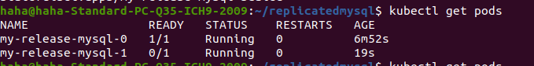

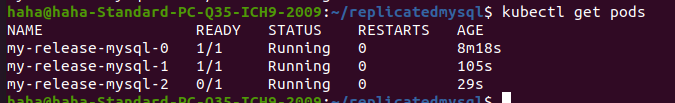

Scale has taken it’s place. They restarted (for a reason of scaling i guess ?)

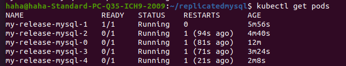

why 

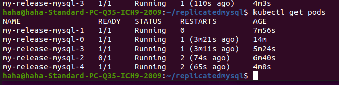

Oops.. 

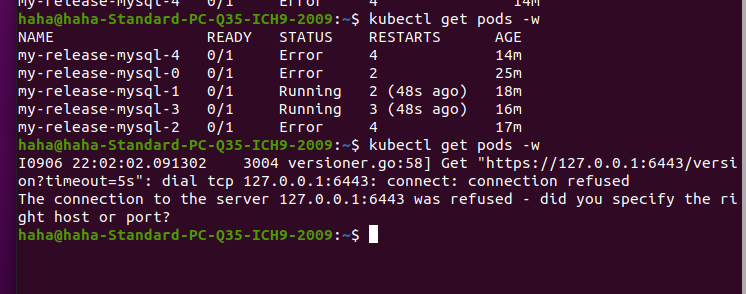

Something is unreliable and i dont want unreliable gcp..

Backup plan !

#and i'm sorry to time is up to submit project i'll make it properly next time ...